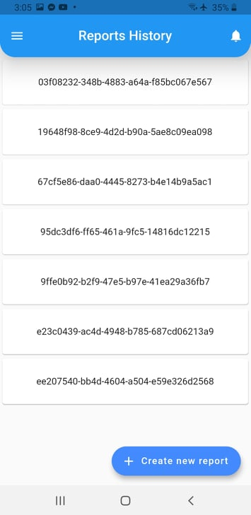
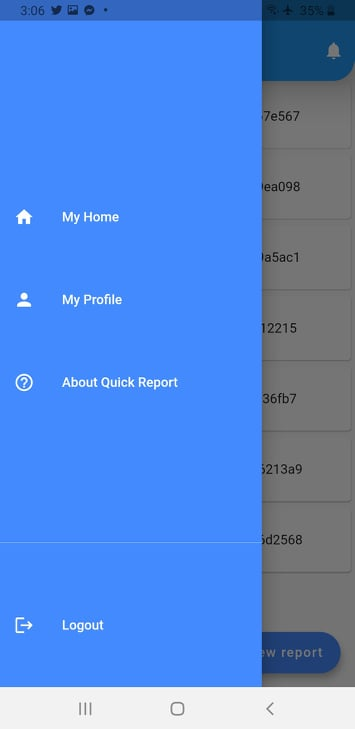
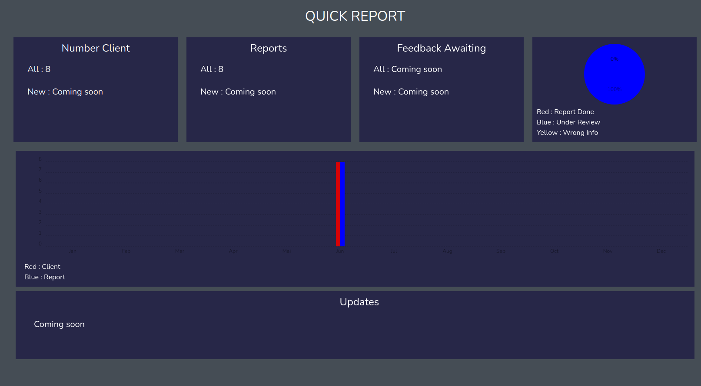
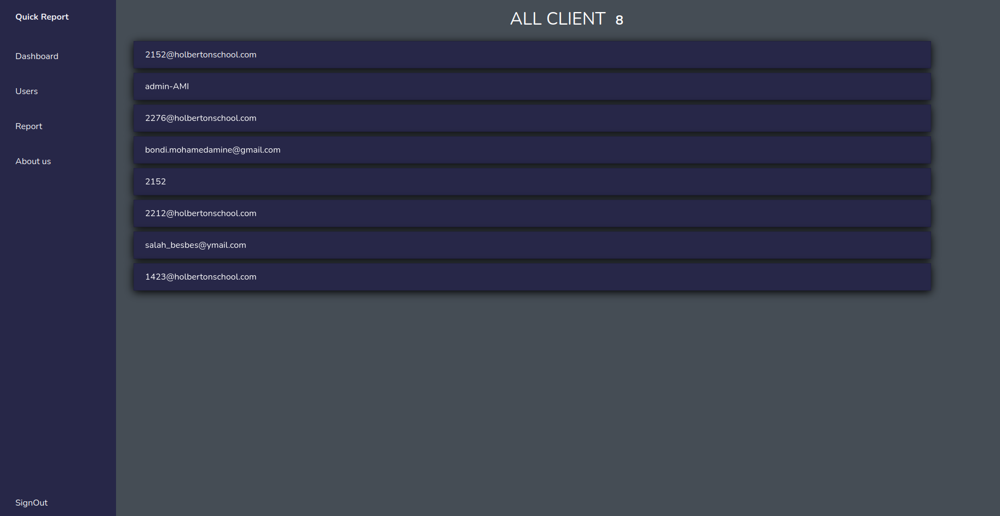

# <p align="center"> Quick Report </p>

## Table of Content

- [Introduction](#introduction)
- [Environment](#environment)
- [Installation](#installation)
- [Usage](#usage)
- [Galleries](#Galleries)
- [Authors](#authors)
- [License](#license)

# Introduction

Quick Report is a web app and mobile app that allow users to accomplish sending traffic car crash report safely and quickly by transmitting the cars, drivers, and crash information instantly and directly to the insurance company of each user. So the app is useful for both vehicle owners and insurance companies.

For more details, click on this [Link](https://theemiss.github.io/Landing-page-quick-report/landing)

This project was created by:

- [Ahmed Belhaj](https://www.linkedin.com/in/ahmed-belhaj-bb845619b/)
- [Mohamed Chedli](https://www.linkedin.com/in/mohamed-chedli-14113a1b7/)
- [Mohamed Amin Bondi](https://www.linkedin.com/in/mohamed-amine-bondi-67bb1b171/)

# Environment

This project is interpreted/tested on Ubuntu 20.04 LTS using python3 (version 3.8.5) Flutter(version 2.0) React(Version 17.0.2)

# Installation

### Requirements:

    - Dart
    - Flutter
    - Android Studio
    - Jdk 8
    - Python 3
    - node
    - npm
    - pip

- Clone this repository on your PC

- Connect your android phone with your IDE
- Type the command flutter run on the terminal (or cmd prompt on windows)

### Mobile Environment

To install and test the app on your android phone, you need to follow these steps:

```Bash
$ cd mobile_app
$ flutter run
Launching lib/main.dart on Android phone in debug mode

....
To hot reload changes while running, press "r". To hot restart (and rebuild state)
...
to quit press "q".
```

The apk file will be installed on your your phone, then you can use the mobile app.

### Web Environment

follow this Steps:

```bash
$ cd web_app
$ npm install
...
$ npm start
...
Search for the keywords to learn more about each warning.
To ignore, add // eslint-disable-next-line to the line before.
...
```

- go to your web browser and type `http://localhost:3000/`

### Backend and API

follow this steps

```bash
$ python3 -m [virtual env name] .
$ pip install -r requirements.txt
$ . /[virtual env name]/bin/activate
$ python wsgi.py
* Serving Flask app 'api.v1.app' (lazy loading)
 * Environment: production
   WARNING: This is a development server. Do not use it in a production deployment.
   Use a production WSGI server instead.
 * Debug mode: on
 * Running on http://127.0.0.1:5000/ (Press CTRL+C to quit)
 * Restarting with stat
```

- Backend Server Already Deployed

# Usage

Use Mobile App To Create an account and fill a report
use Web App to log in as an admin
`Credential [email:admin][password:admin]`

# Galleries






# Authors

- Ahmed Belhaj
  - [Email](2152@holobertonschool.com)
  - [Linkedin](https://www.linkedin.com/in/ahmed-belhaj-bb845619b/)
- Mohamed Chedli
  - [Email](2276@holobertonschool.com)
  - [Linkedin](https://www.linkedin.com/in/mohamed-chedly/)
- Mohamed Amin Bondi
  - [Email](2212@holobertonschool.com)
  - [Linkedin](https://www.linkedin.com/in/mohamed-amine-bondi-67bb1b171/)

# License

Free To use

[MIT](https://github.com/Theemiss/Quick_Report/blob/main/LICENSE)

# More info

- [Azure Deployed API ](http://quickreport.southafricanorth.cloudapp.azure.com/)
- [Documentation API](http://102.37.113.211/api/spec.html#!/spec)
- [Landing Page](https://theemiss.github.io/Landing-page-quick-report/landing)

This project was made as an End Of Year Project at Holberton School


<p align="center"></p>
